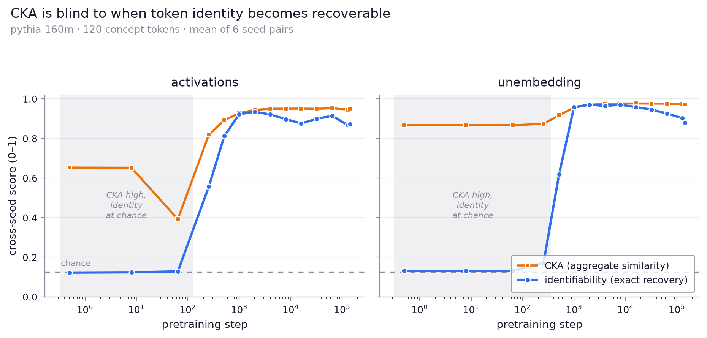
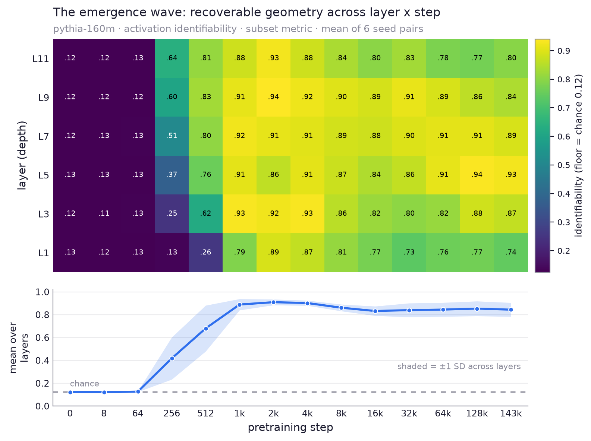
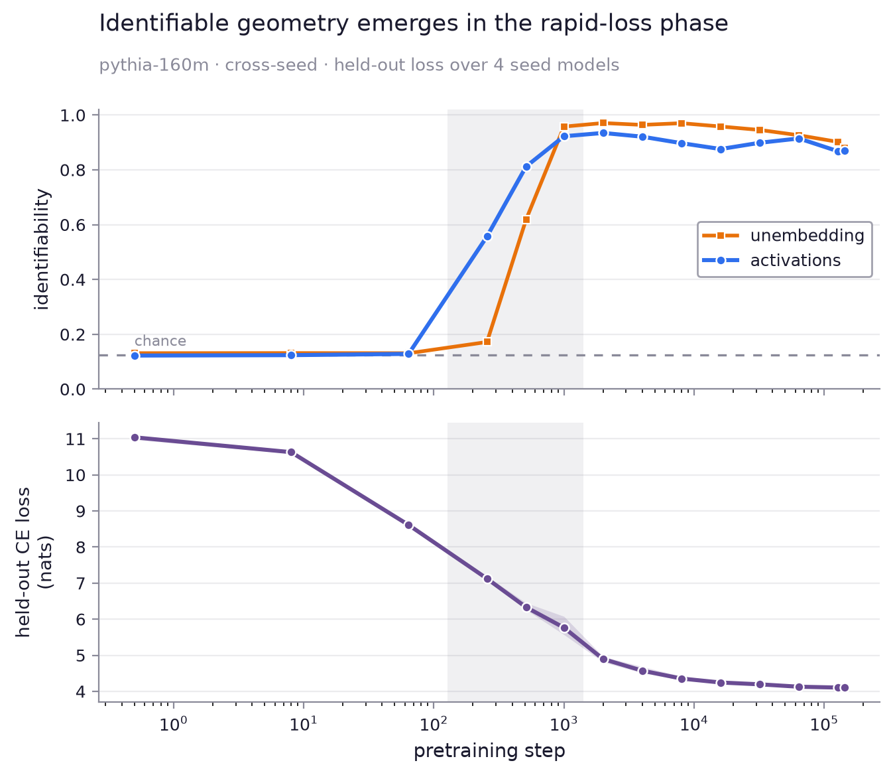
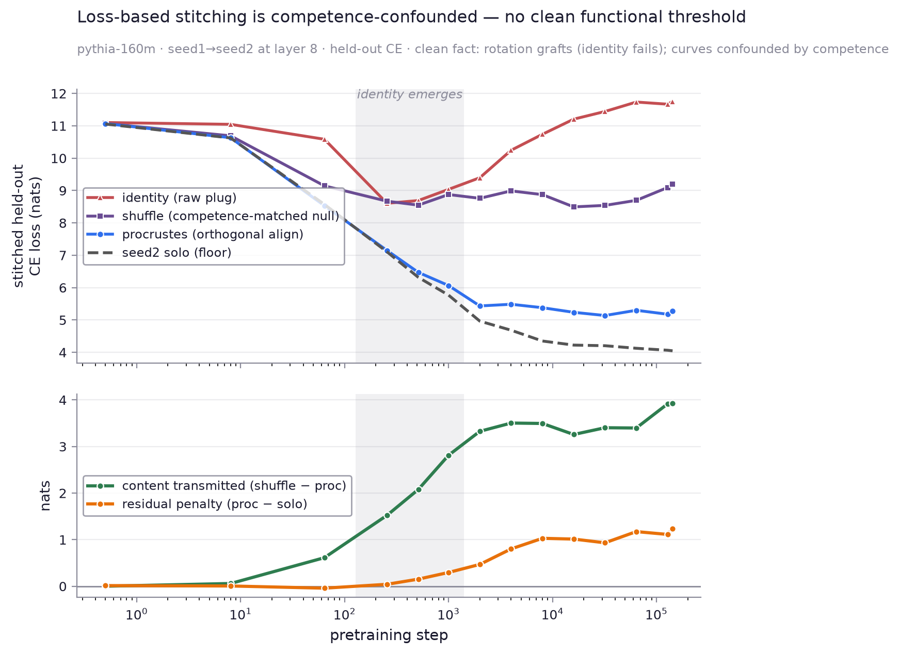

# Representational-identity emergence

When during pretraining does convergent representational geometry crystallize —
and does standard similarity (CKA) see it?

We take **independently seeded** pythia-160m runs (seed1–seed4) and, at each of
~14 published checkpoints (`step0` → `step143000`), ask a label-free question:
can the identity of concept tokens be recovered from **relational structure
alone**? Identifiability is averaged over all 6 cross-seed pairs.
For each model we build the cosine-Gram matrix of a fixed 120-word concept set
and match the two Grams across seeds — no labels, only the shape of the
similarity structure (the method of `gram_matrix_decoder`).

Two direction families are compared:

- **activations** — the contextual residual-stream vector for each word at layer
  ⅔ depth (mean over 3 neutral templates); a stimulus representation.
- **unembedding** — the token's row in the output-embedding matrix; the static
  output interface.

## Findings

- **Identifiable geometry emerges as an early transition.** Both families sit at
  chance through ~step 64, then rise to near-ceiling by ~step 1000 — under 1% of
  the training run.
- **Staggered by family.** Activation identity crystallizes first (recoverable at
  step 256 while the unembedding is still at chance); the output interface catches
  up by step ~1000.
- **A high CKA does not imply recoverable identity — the methodological point.**

  CKA's absolute scale is uninterpretable: it is already **0.87** (unembedding)
  or **0.65** (activations) between two *randomly initialized* networks (dotted
  line), and even dips non-monotonically (activations, 0.39 at step 64). Its
  whole span to convergence is small, so the same CKA value (~0.9) is consistent
  with both unrecoverable and perfectly recoverable identity. Exact
  permutation-recovery, anchored at a known chance floor (1/8), separates what
  CKA compresses. (Honest caveat: normalized to its own null→ceiling range, CKA
  *does* rise in the same window — the issue is scale/interpretability, not
  timing, so this is not a "CKA is blind" claim.) See `plot_cka.py`.

Metric note: the plotted line is the robust **subset** metric — 200 random
8-token sub-Grams matched exhaustively over all 8! permutations, chance = 1/8.
The harder full-120 metric and CKA are also stored in `curve.json`.

### By layer

Probing every other layer (`layer_sweep.py` → `plot_layers.py`) resolves the
emergence by depth:

- **Deep layers first.** At the onset (step 256) the deepest probed layers are
  already well above chance (layer 11 ≈ 0.65) while layer 1 is still at chance —
  recoverable geometry crystallizes top-down and the shallowest layer only
  catches up near step 1000.
- **Mid-depth is most seed-stable at convergence.** Late in training the
  middle layers (≈5–7) carry the most seed-invariant structure; the deepest and
  shallowest layers sit lower and drift more across seeds.

The two regimes side by side (`plot_layer_bars.py`):

At the onset (step 256) identifiability rises monotonically with depth; by the
end of training the profile is an inverted-U peaked around layer 5. Whiskers show
the range across the 6 seed pairs: the deep-first staircase is tight (robust),
while the deepest layers carry the most spread at convergence — consistent with
deep-layer late divergence across seeds.

### Summary: the emergence wave

The whole pattern in one image — rows = layer, columns = step, color =
identifiability. A dark chance plain (early steps), a diagonal emergence front at
step 256→1000 (deep rows light up first), and a mid-depth ridge at convergence.
The marginal line below is the mean across layers; its ±1 SD band is wide at the
onset (layers disagree — deep-first) and narrow once every layer has organized.
An exploratory 3D-surface version is in `outputs/emergence_surface3d.png`
(`plot_surface3d.py`).

### Does the transition mean anything? (training dynamics)

Held-out cross-entropy per checkpoint (mean over the 4 seed models,
`loss_sweep.py` → `plot_loss.py`) gives an external reference axis. Identifiable
geometry emerges in the **rapid-loss phase** (shaded) and saturates as loss
enters its slow tail — tying the geometry milestone to the model's actual
learning rather than an arbitrary step. Honest caveat: most of the raw CE drop
(11 → ~7) happens *before* identity emerges; the transition coincides with the
later CE 7 → 6 portion. This is a correlation, not yet a functional link — that
needs the stitching test (does identifiability onset predict when a layer can be
transplanted across seeds?).

### Functional test: stitching — INCONCLUSIVE (kept as an honest negative)

We tried to give the threshold a functional meaning by splicing seed1 into seed2
at layer 8 (`stitch_sweep.py`): run seed1 up to the layer, map its residual
stream into seed2's space, let seed2 finish, measure held-out CE. It does **not**
work as a test of "the threshold marks a functional change" — every loss-based
readout is confounded by model competence, which changes fastest exactly in the
emergence window.

- The one **clean, competence-free** fact: an **orthogonal rotation suffices** to
  graft one seed into another (procrustes tracks seed2's floor; raw identity
  fails and *worsens* with training). That is a rotation-equivalence result — but
  static, with no bearing on the emergence threshold.
- The curves that looked like a functional onset are all confounded:
  procrustes reaches the solo floor *before* identity emerges (penalty ≈ 0 at
  step 64–256) — vacuous, since the floor there is garbage (ppl ~5000); the
  penalty's later growth is confounded by the floor becoming demanding; the
  `shuffle − procrustes` "content" is confounded by content-*amount*, not graft
  fidelity. All move because the model is learning.

Verdict: the functional importance of the emergence threshold is **not
established** — loss-based stitching is the wrong instrument (too
competence-confounded), and what signal exists points to "the graft was fine all
along," not "compatibility emerges." The clean, competence-free results in this
repo are the geometric ones (label-free identifiability is chance-anchored and
not competence-confounded).

Caveats: one architecture (160m); 6 seed pairs (all combinations of 4 seeds, so
the pairs share seeds and the spread is a robustness range, not a formal CI). The
transition *sharpness* still rests on a coarse step grid — densify steps 64–512
before making a phase-transition claim. The family/depth *ordering* reproduces
across all pairs.

## Run

    pip install -r requirements.txt
    python -m emergence.sweep --mode extract    # downloads/caches checkpoints, ~minutes
    python -m emergence.sweep --mode curve       # -> outputs/curve.json
    python -m emergence.plot                     # -> outputs/emergence.png

Extraction caches one npz per (seed, step, family) under `outputs/sweep/`
(gitignored); re-runs skip cached checkpoints.
