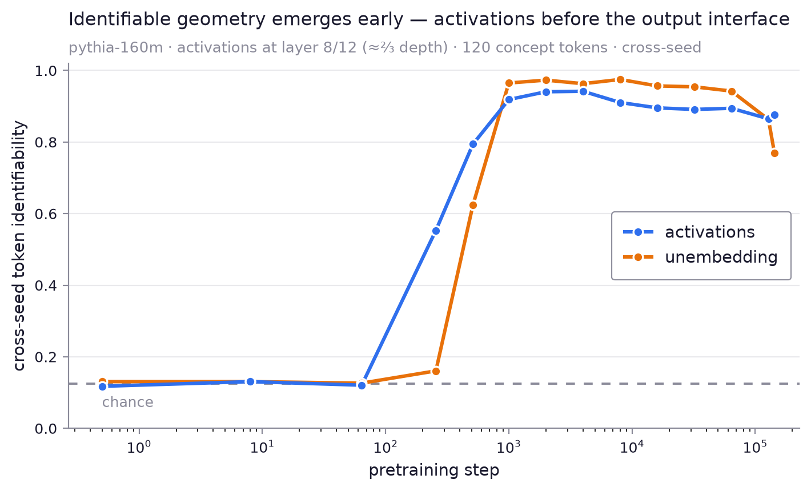
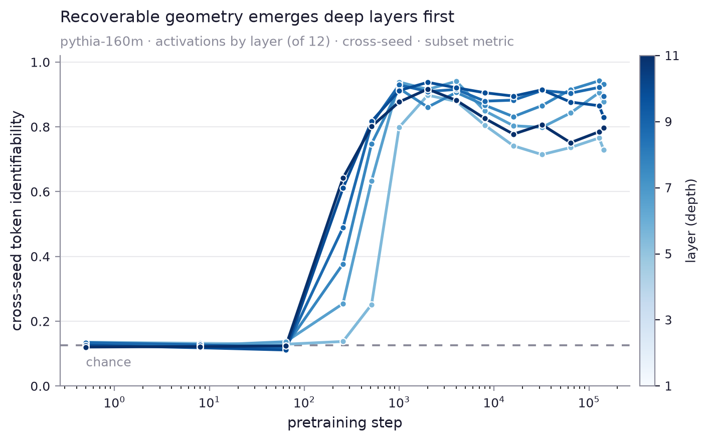
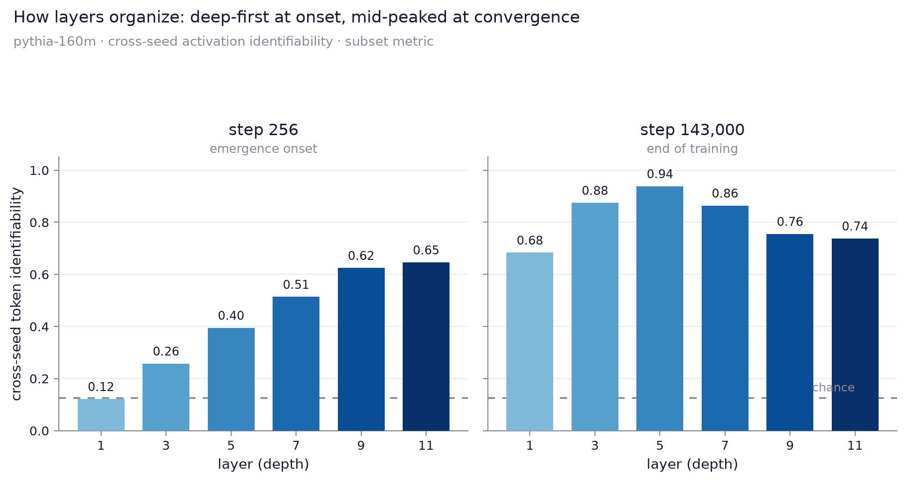

# Representational-identity emergence

When during pretraining does convergent representational geometry crystallize —
and does standard similarity (CKA) see it?

We take two **independently seeded** pythia-160m runs and, at each of ~14
published checkpoints (`step0` → `step143000`), ask a label-free question: can
the identity of concept tokens be recovered from **relational structure alone**?
For each model we build the cosine-Gram matrix of a fixed 120-word concept set
and match the two Grams across seeds — no labels, only the shape of the
similarity structure (the method of `gram_matrix_decoder`).

Two direction families are compared:

- **activations** — the contextual residual-stream vector for each word at layer
  ⅔ depth (mean over 3 neutral templates); a stimulus representation.
- **unembedding** — the token's row in the output-embedding matrix; the static
  output interface.

## Findings

- **Identifiable geometry emerges as an early transition.** Both families sit at
  chance through ~step 64, then rise to near-ceiling by ~step 1000 — under 1% of
  the training run.
- **Staggered by family.** Activation identity crystallizes first (recoverable at
  step 256 while the unembedding is still at chance); the output interface catches
  up by step ~1000.
- **CKA is largely blind to it.** The unembedding's CKA is ~0.87 at random init
  and stays high across the entire window where identifiability goes from chance
  to ceiling — aggregate similarity does not track when identity becomes
  recoverable. (See `cka` in `outputs/curve.json`.)

Metric note: the plotted line is the robust **subset** metric — 200 random
8-token sub-Grams matched exhaustively over all 8! permutations, chance = 1/8.
The harder full-120 metric and CKA are also stored in `curve.json`.

### By layer

Probing every other layer (`layer_sweep.py` → `plot_layers.py`) resolves the
emergence by depth:

- **Deep layers first.** At the onset (step 256) the deepest probed layers are
  already well above chance (layer 11 ≈ 0.65) while layer 1 is still at chance —
  recoverable geometry crystallizes top-down and the shallowest layer only
  catches up near step 1000.
- **Mid-depth is most seed-stable at convergence.** Late in training the
  middle layers (≈5–7) carry the most seed-invariant structure; the deepest and
  shallowest layers sit lower and drift more across seeds.

The two regimes side by side (`plot_layer_bars.py`):

At the onset (step 256) identifiability rises monotonically with depth; by the
end of training the profile is an inverted-U peaked around layer 5.

Caveats: one architecture (160m), one seed pair. The transition *sharpness* and
the family ordering rest on a coarse step grid — densify steps 64–512 and add
seed pairs before making a phase-transition or ordering claim.

## Run

    pip install -r requirements.txt
    python -m emergence.sweep --mode extract    # downloads/caches checkpoints, ~minutes
    python -m emergence.sweep --mode curve       # -> outputs/curve.json
    python -m emergence.plot                     # -> outputs/emergence.png

Extraction caches one npz per (seed, step, family) under `outputs/sweep/`
(gitignored); re-runs skip cached checkpoints.
