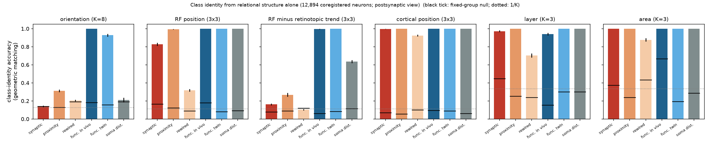
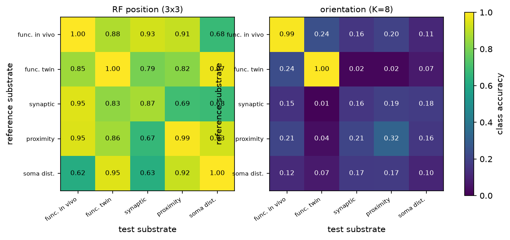
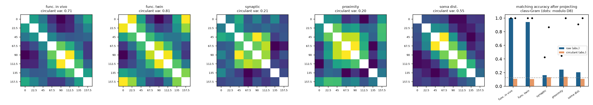
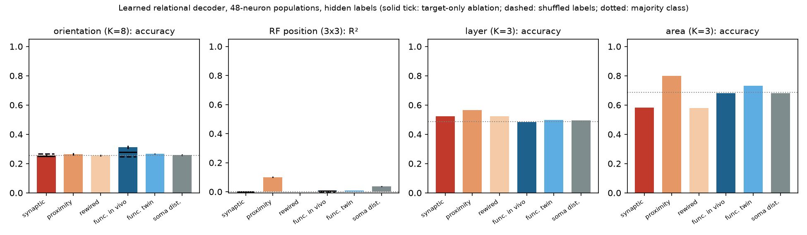
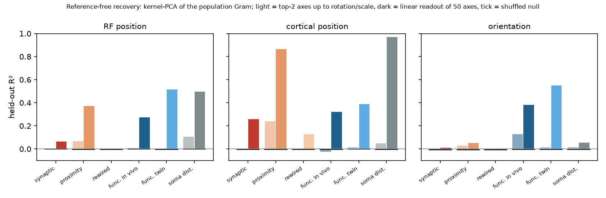

# Representational ambiguity in mouse visual cortex (MICrONS)

Does the relational structure of a real cortical population fix what its
neurons represent?  This is the biological test the paper
(`entropicbloom.github.io/consciousness`) leaves as future work: take neurons
whose content is known (receptive-field position, preferred orientation), hide
the labels, and ask whether the content can be recovered from the *relations*
among neurons alone — first from synaptic connectivity, then from functional
covariation — with the same protocols used on MNIST networks.

## Data

Ding, Fahey, Papadopoulos et al. 2025 functional-connectomics release of the
MICrONS mm³ volume (`functional_connectomics/node_and_edge_properties/v1` on
the public `bossdb-open-data` bucket; one mouse, 13 two-photon scans):

* **12,894 coregistered neurons** with in-vivo preferred orientation and gOSI
  (Monet stimuli), digital-twin receptive-field centre (STA fit, stimulus
  coordinates in [-1, 1]), soma position, layer, area (V1 / RL / AL / LM),
  trial-averaged **in-vivo responses to the shared oracle natural-movie clips**
  (120 samples) and **digital-twin responses to a shared movie** (4,999 samples).
* **148 proofread presynaptic axons** with 8,128 synapses onto 4,811 of the
  coregistered neurons, plus 287,243 **axon-dendrite-proximity (ADP)** pairs:
  postsynaptic dendrites the axon passed within reach of but did *not*
  contact.  Connected ∪ ADP is the axon's *potential* connectivity.

Sanity check that in-vivo oracle responses are comparable across scans:
signal correlation of pairs with overlapping RFs (< 0.1 apart) is 0.062 within
a scan and 0.041 across scans, versus ≈ 0 for far pairs in both cases; same
pattern for orientation (0.078 / 0.065 for Δori < 15°, ≈ -0.01 for Δori > 75°).

## Relational substrates

Each substrate is a neuron × feature matrix; the relational structure is its
cosine Gram (for responses: z-scored rows, so cosine = signal correlation).

| name | rows | relation between two neurons |
|---|---|---|
| `struct_in` | 4,811 postsynaptic neurons | overlap of the sets of proofread axons that synapse onto them (148-dim, synapse counts) |
| `struct_in_adp` | same neurons | overlap of the sets of proofread axons that *could* have contacted them (potential connectivity) |
| `struct_in_rewired` | same neurons | synapses redrawn uniformly within each axon's potential targets, out-degree and synapse-count multiset preserved (proximity-constrained null connectome) |
| `struct_out` / `_adp` / `_rewired` | the 148 axons | overlap of their synaptic (resp. potential, rewired) target sets over all 12,894 neurons |
| `func_iv` | all 12,894 | in-vivo signal correlation (oracle clips) |
| `func_is` | all 12,894 | digital-twin signal correlation (shared movie) |
| `soma` | all 12,894 | Gaussian kernel of soma distance (σ = 100 µm): the purely spatial null |

## Contents (what a neuron represents)

* `ori` — in-vivo preferred orientation, gOSI ≥ 0.25 (n = 5,287), binned into
  K = 8 classes of 22.5° centred on multiples of 22.5°.
* `rf` — receptive-field centre, digital-twin test correlation ≥ 0.2
  (n = 11,326), binned into a 3 × 3 quantile grid (K = 9) or used as 2-D
  regression target.
* `rf_resid` — RF centre minus the local retinotopic map (mean RF of the 50
  nearest same-area somata; the map explains 51–54 % of RF variance).  What
  remains is the local scatter of retinotopy, which cortical location cannot
  predict by construction.
* Anatomical positive controls: `soma_xz` (tangential cortical position,
  3 × 3), `depth` (K = 4), `layer` (K = 3), `area` (V1 / RL / AL, K = 3).

## Protocols

**P1 — geometric matching (paper §3.1.2).**  Neurons are split into two
stratified halves.  The reference half's K × K *class-Gram* (mean relation
between neurons of class a and class b) carries the labels; the test half's
class-Gram is presented with class identities hidden and all K! relabelings
are searched for the smallest Frobenius distance.  Accuracy = fraction of
classes assigned correctly; "hit" = whole permutation correct.  200 random
splits.  Additions to the paper's protocol:

* *Posterior over relabelings*, p(g) ∝ exp(−d_g² / 2τ²), with τ the per-entry
  split-half noise of the correct relabeling.  Its per-class marginal entropy
  is a direct estimate of H(I | R, C) in bits; `ARS post` = 1 − H / log₂K.
  The paper's Fano bound (`ARS Fano`) is reported alongside.
* *Accuracy modulo a symmetry group* — rotations and reflections of the
  orientation circle (D₈), flips/transposes of the RF grid — the relabelings
  a relation that depends only on content *difference* can never resolve.
* Two nulls.  `null indep`: labels shuffled independently inside each half
  (pure chance, 1/K).  `null fixed`: labels shuffled once, i.e. *arbitrary but
  fixed* neuron groups.  The second is conservative: fixed groups can stay
  identifiable across halves through degree heterogeneity alone, so it
  measures content-specific signal beyond "some particular set of neurons".

**P2 — learned decoder with hidden population labels (paper §2.1.4).**  A
population of 48 neurons is sampled; its 48 × 48 Gram is fed row-wise, as
tokens without positional encoding, to a 2-layer / 4-head transformer that
predicts the content of token 0.  Training populations come from one half of
the neurons, validation populations from the other, so the decoder must learn
population-geometry regularities that transfer to unseen neurons.  Ablation
`target_only` removes every relation not involving the target (the paper's
local-vs-global control); `shuffled` trains on permuted labels.

**P3 — reference-free recovery.**  Kernel PCA of the test population's own
Gram; content is read out from the top-2 axes up to rotation/reflection/scale
(orthogonal Procrustes fitted on half the neurons, scored on the other half),
or linearly from the top-10 / top-50 axes.  No other population, no reference
class-Gram, no labels in the embedding.

**Transfer.**  Reference class-Gram from substrate X on one half, test
class-Gram from substrate Y on the other half (z-scored), the paper's
cross-architecture test recast as cross-substrate.

**Symmetry.**  For orientation, the class-Gram is projected onto its
circulant part (relation depends only on Δori; a symmetric circulant matrix is
invariant under the whole dihedral group D₈).  The variance it explains, the
matching accuracy that survives the projection (with random tie-breaking among
the rotations it cannot distinguish), and the posterior mass on the 16
dihedral relabelings quantify how much of orientation identity is fixed by
anisotropy rather than by the difference structure.

## Run

    uv venv --python 3.13 .venv && uv pip install numpy pandas scipy scikit-learn matplotlib torch pyarrow
    # data: see data/ (downloaded from s3://bossdb-open-data/iarpa_microns/minnie/functional_data/...)
    python -m microns_ambiguity.run_geometric
    python -m microns_ambiguity.run_decoder func_iv,func_is,struct_in,struct_in_adp,struct_in_rewired,soma ori,rf full 2
    python -m microns_ambiguity.run_spectral
    python -m microns_ambiguity.transfer
    python -m microns_ambiguity.symmetry
    python -m microns_ambiguity.plots && python -m microns_ambiguity.summarize

## Results

All numbers: 200 random half-splits unless noted; "null" is the pure-chance
null (labels shuffled independently in the two halves) and "fixed" the
arbitrary-fixed-group null.  Full tables: `python -m microns_ambiguity.summarize`.

### 1. Class identity from relational structure (geometric matching)

| substrate | orientation (K=8) | RF position (K=9) | RF minus local map (K=9) | cortical pos. (K=9) | layer (K=3) | area (K=3) |
|---|---|---|---|---|---|---|
| synaptic (shared inputs, n=4,811) | 0.14 (chance) | **0.83** | 0.16 (chance) | 1.00 | 0.97 | 1.00 |
| proximity (potential inputs) | 0.31 | **0.99** | 0.16 (chance)_ADP | 1.00 | 1.00 | 1.00 |
| rewired within reach (null connectome) | 0.20 | **0.32** | 0.16 (chance)_REWIRED | 0.92 | 0.70 | 0.88 |
| functional, in vivo (n=12,894) | **1.00** | 1.00 | 1.00 | 1.00 | 0.94 | 1.00 |
| functional, digital twin | 0.93 (1.00 mod D₈) | 1.00 | 1.00 | 1.00 | 1.00 | 1.00 |
| soma distance (spatial null) | 0.21 (0.91 mod D₈) | 1.00 | 0.64 | 1.00 | 1.00 | 1.00 |
| chance / fixed-group null | 0.13 / 0.13–0.19 | 0.11 / 0.08–0.18 | 0.11 / 0.06–0.12 | 0.11 / 0.06–0.10 | 0.33 / 0.15–0.45 | 0.33 / 0.19–0.67 |

* **Functional relational structure fixes every content we tested.**  From
  signal correlations alone, with class identities hidden, the 8 orientation
  classes and the 9 RF-position classes are recovered exactly in 100 % of
  splits (in vivo), with posterior entropy ≈ 0 bits: H(I | R, C) = 0 in the
  paper's terms.  The permutation-distance picture is the one the paper shows
  for dropout networks — the true labelling is separated from all 40,319
  alternatives (`perm_distances.png`, left).

* **Synaptic relational structure fixes *where* a neuron looks, not *which
  orientation* it prefers.**  Shared-input overlap identifies RF-position
  classes at 83 % (posterior entropy 0.24 of 3.17 bits) but orientation at
  chance.  The failure is not lack of like-to-like wiring: after projecting the
  orientation class-Gram onto its Δori-only (circulant) part, synaptic
  relations identify orientation *modulo rotations/reflections* at 87 %
  (null 45 %; §3).  There is a Δori-dependent structure in who shares inputs
  with whom — but it is symmetric, so it cannot say which class is 0°.

* **Most, but not all, of the RF content in synapses is cortical location.**
  Potential connectivity (which axons *could* have contacted a dendrite) does
  better than actual synapses (99 % vs 83 %), and so does raw soma distance
  (100 %).  Cortical position is trivially recoverable from any of these
  (100 %).  The proximity-constrained rewired connectome — same axons, same
  out-degrees, partners redrawn among each axon's reachable dendrites — is
  the fair comparison at matched sparsity: 32 % vs 83 %.  Synaptic
  *specificity* therefore adds RF information beyond proximity, consistent
  with Ding et al.'s like-to-like result, here stated as identifiability of
  content rather than as a connection-probability ratio.  The residual-RF
  column (RF minus the mean RF of the 50 nearest same-area somata; the local
  map explains 51–54 % of RF variance) is the direct test of whether any of
  this survives once cortical location is removed: it does not.  Synaptic relations
  identify the local RF scatter at chance (0.16; proximity 0.27, mostly
  residual spatial structure, since soma distance alone still gives 0.64),
  while functional relations identify it perfectly (1.00 in vivo and in the
  twin).  At this sparsity, synaptic relational structure carries RF content
  at the level of the retinotopic map, not of the individual neuron; functional
  relational structure carries both.

* **The 148 proofread axons (target-set overlap) are too few for K > 4**
  (`geometric_axons.png`); only area (84 %) and cortical position (52 %) rise
  clearly above the nulls.  Their fixed-group null for area is 79 % under
  potential connectivity — an arbitrary fixed set of 50 axons is almost as
  identifiable as a real area from where their axons go.  This is why the
  fixed-group null is reported everywhere: a fixed set of specific neurons is
  consistently "itself" across halves through degree heterogeneity alone, and
  it stays above chance even at n = 12,894 for unbalanced classes (area,
  in vivo: 0.67).  The content-specific claim is always relative to it.

### 2. Cross-substrate transfer (the paper's cross-architecture test)

Reference class-Gram from one substrate, test class-Gram from another (disjoint
neurons, z-scored).  RF-position geometry transfers across every substrate:
functional → synaptic 0.93, synaptic → functional 0.95, proximity → functional
0.95, soma → digital twin 0.95.  Retinotopy imposes one relational geometry on
who covaries with whom, who shares inputs with whom, and who sits next to
whom.  Orientation transfers between in-vivo and digital-twin covariance only
*modulo* D₈ (accuracy 0.24, 1.00 modulo rotation/reflection): both carry the
same Δori structure but different anisotropies, so the twin's absolute
orientation frame is not the animal's.  Orientation does not transfer to or
from any structural substrate.

### 3. What fixes absolute orientation: anisotropy, not the difference rule

| substrate | circulant share of class-Gram variance | accuracy raw (mod D₈) | after circulant projection (mod D₈) | null (mod D₈) |
|---|---|---|---|---|
| functional, in vivo | 0.71 | 1.00 (1.00) | 0.11 (1.00) | 0.13 (0.41) |
| functional, digital twin | 0.81 | 0.94 (1.00) | 0.10 (1.00) | 0.13 (0.39) |
| synaptic | 0.21 | 0.16 (0.42) | 0.13 (0.87) | 0.12 (0.40) |
| proximity | 0.20 | 0.24 (0.45) | 0.14 (1.00) | 0.14 (0.39) |
| soma distance | 0.55 | 0.20 (0.91) | 0.11 (1.00) | 0.12 (0.39) |

A relation that depends only on Δori is invariant under the 16 rotations and
reflections of the orientation circle; such a structure can fix orientation
only up to D₈, leaving log₂16 = 4 bits of ambiguity.  Projecting the
functional class-Gram onto its circulant part does exactly that: absolute
accuracy collapses to chance (0.11) while accuracy modulo D₈ stays at 1.00.
The 29 % of variance that is *not* circulant — a cardinal bias whose strength
differs by area (V1: 25 % of neurons within ±11° of horizontal; AL: 29 % near
vertical) — is what makes absolute orientation identifiable, and the posterior
puts mass 1.00 on the identity and 0 on the other 15 dihedral relabelings.
Soma distance identifies orientation modulo D₈ at 0.91 and puts 0.61 of its
posterior mass on the dihedral group: the area-wise cardinal bias, laid out
along the cortical axis, gives the *difference* structure of orientation a
spatial signature but not its absolute frame.  This is the empirical version
of the automorphism argument: residual ambiguity = the symmetry group of the
relational structure, and it is broken by anisotropy, not by more relations.

### 4. Learned decoder with hidden population labels

| substrate | orientation acc (K=8) | RF R² | layer acc | area acc |
|---|---|---|---|---|
| synaptic | 0.26 | 0.00 | 0.52 | 0.58 |
| proximity | 0.26 | **0.10** | 0.57 | **0.80** |
| rewired | 0.26 | 0.00 | 0.52 | 0.58 |
| functional, in vivo | **0.31** (0.33 at n=128; target-only 0.28) | 0.01 (0.01 at n=128) | 0.48 | 0.68 |
| functional, digital twin | 0.26 (0.27 at n=128) | 0.01 | 0.50 | 0.73 |
| soma distance | 0.26 | 0.04 | 0.50 | 0.68 |
| majority class / shuffled labels | 0.25 / 0.25–0.27 | 0 / 0.00 | 0.49 | 0.69 |

Mean over 2 seeds (orientation, RF) or 1 seed; 48-neuron populations, 24k
training populations × 10 epochs; n=128 for the functional substrates
(a 256-neuron sweep was killed by the OS for memory and is not reported).

**This protocol fails in cortex.**  With population labels hidden and only 48
(or 128) neurons per population, the decoder stays at the class-prior baseline
for every substrate and content except a small orientation gain from in-vivo
covariance (0.31–0.33 vs 0.25, of which the target-only ablation keeps 0.28)
and a small RF gain from proximity relations (R² 0.10).  Class-level matching
on the same Grams is perfect.  The difference is signal-to-noise: pairwise
signal correlations are 0.03–0.06 even for neurons with overlapping RFs, so a
48-neuron Gram is a noisy sample in which the target's row cannot be
anchored to anyone else's unknown content, whereas the class-Gram pools
10⁵–10⁶ pairs.  The paper's decoder had 784-neuron populations with strong,
low-noise weight similarities.  Going to 128 neurons did not change the
picture; whether 10³-neuron populations would is the obvious next test and
needs more memory than this run had.  The honest reading: in cortex the
content is in the relational structure, but recovering it *per neuron without
any labelled anchor* needs far more relational context than the paper's
networks did.

### 5. Reference-free recovery

| substrate | RF: top-2 up to rotation/scale | RF: linear, 50 axes | orientation: linear, 50 axes | cortical position: linear, 50 axes |
|---|---|---|---|---|
| synaptic | 0.00 | 0.06 | 0.01 | 0.26 |
| proximity | 0.07 | 0.37 | 0.05 | 0.87 |
| rewired | 0.00 | 0.01 | 0.00 | 0.13 |
| functional, in vivo | 0.01 | 0.28 | 0.38 | 0.32 |
| functional, digital twin | 0.00 | 0.52 | 0.55 | 0.39 |
| soma distance | 0.11 | 0.50 | 0.06 | 0.97 |

Held-out R² of content read out from the kernel-PCA embedding of the test
population's own Gram (no reference population, no labels in the embedding;
shuffled-label nulls are ≤ 0.01).  The leading two axes of no substrate are a
retinotopic map up to a similarity transform (R² ≤ 0.11): unlike the pixel
covariance of an image, the dominant relational axes in cortex are not visual
space (for soma distance they are cortical space, R² 0.97 for position, and
retinotopy is only their correlate).  Content is present *linearly* in the top
50 axes — RF at 0.52, orientation at 0.55 from digital-twin covariance —
i.e. it is in the relational structure but not as its principal geometry.
Reference-free recovery is therefore weaker than reference-based recovery by a
wide margin here, the opposite of the MNIST input layer, and the "up to
automorphism" reading needs a labelled reference or a learned decoder to pick
out the content-bearing subspace.

## What this says for the paper

1. **A biological population passes the paper's test — for functional
   relational structure.**  Orientation and RF position are unambiguously
   specified (H(I|R,C) = 0 bits) by signal correlations among 12,894 neurons
   in one mouse, with the same permutation-matching protocol used for dropout
   MNIST networks, and the class-level geometry transfers across substrates
   as the MNIST geometry transferred across architectures.

2. **Structural connectivity is a weaker and more confounded carrier.**  In a
   1 mm³ volume the relational structure of synapses is dominated by where
   neurons are.  RF position is identifiable from synaptic relations, mostly
   through cortical location, partly through wiring specificity (rewired
   null); orientation is not identifiable at all in absolute terms, and only
   modulo D₈ once the difference structure is denoised.  The paper's
   "structural connectivity is a stable proxy for functional" (Limitation 3)
   does not hold in cortex at this scale.

3. **Ambiguity has a symmetry structure.**  The Fano-bound ARS hides it; the
   posterior over relabelings and the accuracy-modulo-group make it explicit.
   For a circular quality space the difference rule leaves a dihedral
   ambiguity, and what resolves it in cortex is anisotropy of the
   representation (cardinal bias), not richer relations.  This is a concrete,
   testable refinement of the "relational structure fixes content" claim: it
   fixes content up to the automorphism group of the relational structure, and
   content is absolutely fixed only where the structure is asymmetric.

4. **Per-neuron recovery without an anchor is the open problem.**  Both the
   reference-free embedding and the hidden-label decoder are weak here: the
   dominant axes of cortical relational structure are cortical space, pairwise
   relations are noisy, and a small population cannot bootstrap its own frame.
   The class-level result says the content *is* in the relations; the
   per-neuron results say that extracting it intrinsically needs either a
   labelled reference or a population large enough to embed itself.

5. **Reference-free recovery does not come for free.**  The dominant axes of
   cortical relational structure are cortical space, not visual space or
   orientation.  Whatever fixes content intrinsically has to do so from a
   non-dominant subspace, which is a real constraint for any intrinsic
   (decoder-free) reading of the framework.

## Caveats

* One animal, one volume, one proofreading set (148 axons; postsynaptic
  neurons see ≈ 1.7 proofread inputs on average).  The structural substrates
  are extremely sparse; the rewired null is the only density-matched control.
* RF centres and digital-twin responses are model-derived (Wang et al. 2025);
  orientation and in-vivo covariance are not.  Orientation labels are gated
  at gOSI ≥ 0.25 (5,287 of 12,894 neurons).
* In-vivo oracle responses are compared across 13 scans; same-scan pairs are
  ≈ 50 % more correlated than cross-scan pairs at matched RF distance, a
  session effect that the stratified splits do not remove but that cannot
  create orientation- or RF-specific class structure.
* The class-level protocol is the paper's; it hides class *identities* but
  keeps class *membership* (which neurons belong together).  Protocol 2 (the
  learned decoder) removes that too and fails at 48–128 neurons; larger
  populations were not feasible on this machine.
* ARS from the permutation posterior assumes iid Gaussian entry noise on the
  class-Gram; τ is calibrated from the split-half distance of the correct
  labelling.  It agrees with the Fano bound where both are informative.
