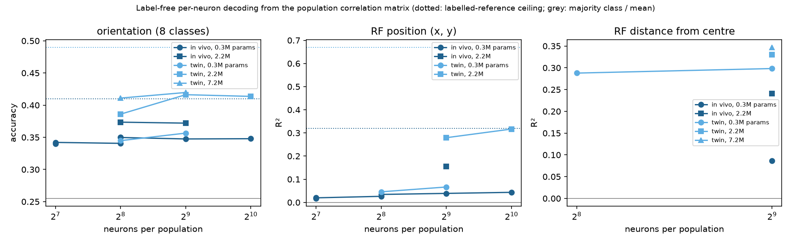
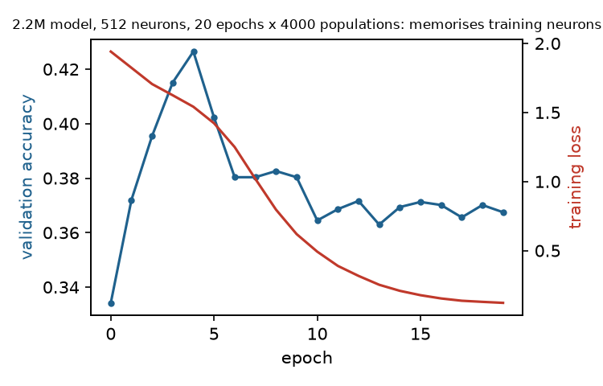

# Representational ambiguity in mouse visual cortex (MICrONS)

Does the relational structure of a real cortical population fix what its
neurons represent, and up to which symmetries?  This applies the
relational-decoding framework of arXiv:2512.11000 (§4.4 there names the
biological test) to cortex: take neurons whose content is known
(receptive-field position, preferred orientation), hide the labels, and ask
whether the content can be recovered from the *relations* among neurons alone —
from synaptic connectivity and from functional covariation — first at the class
level with a labelled reference, then per neuron with no reference at all.

## Data

Ding, Fahey, Papadopoulos et al. 2025 functional-connectomics release of the
MICrONS mm³ volume (`functional_connectomics/node_and_edge_properties/v1` on
the public `bossdb-open-data` bucket; one mouse, 13 two-photon scans):

* **12,894 coregistered neurons** with in-vivo preferred orientation and gOSI
  (Monet stimuli), digital-twin receptive-field centre (STA fit, stimulus
  coordinates in [-1, 1]), soma position, layer, area (V1 / RL / AL / LM),
  trial-averaged **in-vivo responses to the shared oracle natural-movie clips**
  (120 samples) and **digital-twin responses to a shared movie** (4,999 samples).
* **148 proofread presynaptic axons** with 8,128 synapses onto 4,811 of the
  coregistered neurons, plus 287,243 **axon-dendrite-proximity (ADP)** pairs:
  postsynaptic dendrites the axon passed within reach of but did *not*
  contact.  Connected ∪ ADP is the axon's *potential* connectivity.

Sanity check that in-vivo oracle responses are comparable across scans:
signal correlation of pairs with overlapping RFs (< 0.1 apart) is 0.062 within
a scan and 0.041 across scans, versus ≈ 0 for far pairs in both cases; same
pattern for orientation (0.078 / 0.065 for Δori < 15°, ≈ -0.01 for Δori > 75°).

## Relational substrates

Each substrate is a neuron × feature matrix; the relational structure is its
cosine Gram (for responses: z-scored rows, so cosine = signal correlation).

| name | rows | relation between two neurons |
|---|---|---|
| `struct_in` | 4,811 postsynaptic neurons | overlap of the sets of proofread axons that synapse onto them (148-dim, synapse counts) |
| `struct_in_adp` | same neurons | overlap of the sets of proofread axons that *could* have contacted them (potential connectivity) |
| `struct_in_rewired` | same neurons | synapses redrawn uniformly within each axon's potential targets, out-degree and synapse-count multiset preserved (proximity-constrained null connectome) |
| `struct_out` / `_adp` / `_rewired` | the 148 axons | overlap of their synaptic (resp. potential, rewired) target sets over all 12,894 neurons |
| `func_iv` | all 12,894 | in-vivo signal correlation (oracle clips) |
| `func_is` | all 12,894 | digital-twin signal correlation (shared movie) |
| `soma` | all 12,894 | Gaussian kernel of soma distance (σ = 100 µm): the purely spatial null |

## Contents (what a neuron represents)

* `ori` — in-vivo preferred orientation, gOSI ≥ 0.25 (n = 5,287), binned into
  K = 8 classes of 22.5° centred on multiples of 22.5°.
* `rf` — receptive-field centre, digital-twin test correlation ≥ 0.2
  (n = 11,326), binned into a 3 × 3 quantile grid (K = 9) or used as 2-D
  regression target.
* `rf_resid` — RF centre minus the local retinotopic map (mean RF of the 50
  nearest same-area somata; the map explains 51–54 % of RF variance).  What
  remains is the local scatter of retinotopy, which cortical location cannot
  predict by construction.
* Anatomical positive controls: `soma_xz` (tangential cortical position,
  3 × 3), `depth` (K = 4), `layer` (K = 3), `area` (V1 / RL / AL, K = 3).

## Protocols

**P1 — geometric matching (paper §3.1.2).**  Neurons are split into two
stratified halves.  The reference half's K × K *class-Gram* (mean relation
between neurons of class a and class b) carries the labels; the test half's
class-Gram is presented with class identities hidden and all K! relabelings
are searched for the smallest Frobenius distance.  Accuracy = fraction of
classes assigned correctly; "hit" = whole permutation correct.  200 random
splits.  Additions to the paper's protocol:

* *Posterior over relabelings*, p(g) ∝ exp(−d_g² / 2τ²), with τ the per-entry
  split-half noise of the correct relabeling.  Its per-class marginal entropy
  is a direct estimate of H(I | R, C) in bits; `ARS post` = 1 − H / log₂K.
  The paper's Fano bound (`ARS Fano`) is reported alongside.
* *Accuracy modulo a symmetry group* — rotations and reflections of the
  orientation circle (D₈), flips/transposes of the RF grid — the relabelings
  a relation that depends only on content *difference* can never resolve.
* Two nulls.  `null indep`: labels shuffled independently inside each half
  (pure chance, 1/K).  `null fixed`: labels shuffled once, i.e. *arbitrary but
  fixed* neuron groups.  The second is conservative: fixed groups can stay
  identifiable across halves through degree heterogeneity alone, so it
  measures content-specific signal beyond "some particular set of neurons".

**P2 — learned decoder with hidden population labels (paper §2.1.4).**  A
population of *n* neurons is sampled; its *n × n* Gram is fed row-wise, as
tokens without positional encoding, to a transformer that predicts each
token's content.  Training populations come from one half of the neurons,
validation populations from the other, so the decoder must learn
population-geometry regularities that transfer to unseen neurons.  The first
version (`decoder.py`: 48 neurons, token-0 supervision) and its iteration
(`decoder2.py`: on-the-fly Grams, dense supervision, optional relational
attention bias, early stopping on a held-out slice of the training neurons)
are both reported in §4.  Ablation `target_only` removes every relation not
involving the target (the paper's local-vs-global control); `shuffled` trains
on permuted labels; `anchored` (diagnostic only) gives the other tokens their
true labels.

**P3 — reference-free recovery.**  Kernel PCA of the test population's own
Gram; content is read out from the top-2 axes up to rotation/reflection/scale
(orthogonal Procrustes fitted on half the neurons, scored on the other half),
or linearly from the top-10 / top-50 axes.  No other population, no reference
class-Gram, no labels in the embedding.

**Transfer.**  Reference class-Gram from substrate X on one half, test
class-Gram from substrate Y on the other half (z-scored), the paper's
cross-architecture test recast as cross-substrate.

**Symmetry.**  For orientation, the class-Gram is projected onto its
circulant part (relation depends only on Δori; a symmetric circulant matrix is
invariant under the whole dihedral group D₈).  The variance it explains, the
matching accuracy that survives the projection (with random tie-breaking among
the rotations it cannot distinguish), and the posterior mass on the 16
dihedral relabelings quantify how much of orientation identity is fixed by
anisotropy rather than by the difference structure.

## Run

    uv venv --python 3.13 .venv && uv pip install numpy pandas scipy scikit-learn matplotlib torch pyarrow
    # data: see data/ (downloaded from s3://bossdb-open-data/iarpa_microns/minnie/functional_data/...)
    python -m microns_ambiguity.run_geometric
    python -m microns_ambiguity.run_decoder func_iv,func_is,struct_in,struct_in_adp,struct_in_rewired,soma ori,rf full 2
    python -m microns_ambiguity.run_spectral
    python -m microns_ambiguity.transfer
    python -m microns_ambiguity.symmetry
    python -m microns_ambiguity.plots && python -m microns_ambiguity.summarize
    # per-neuron decoder iteration (see data/sweep*.sh for the exact runs)
    python -m microns_ambiguity.run_decoder2 <tag> func_is rf n=512 dim=256 layers=4 rel_bias=1 device=mps batch=8 epochs=20 pops_per_epoch=4000 early_stop=0.15 pca=1
    python -m microns_ambiguity.plot_decoder2 && python -m microns_ambiguity.summarize_decoder2

## Findings so far (2026-09-12; run ledger and in-flight queue in `STATUS.md`)

Orientation is decoded as a continuous angle; the metric is mean angular error, chance 45°.

- **Content from relations alone.** A 17M transformer that sees only the 512 × 512 correlation matrix of a sampled population decodes preferred orientation to 20.2° (twin) / 25.4° (in vivo) and receptive-field position at R² 0.48 / 0.23, on held-out neurons; three seeds and three neuron splits agree within 1°.
- **The frame is recovered.** The error after the best global rotation or reflection equals the raw error in every run.
- **The readout is cardinal.** Horizontal vs vertical is right for 87 % / 79 % of neurons (chance 56 %); obliques sit near chance; 72 % of predictions fall on 0° or 90°. Labels are bimodal at 0°/90° in MICrONS but flat in Allen, where the readout is cardinal too, so the pattern comes from the correlation structure, not from label density (best constant 41°, scan/area prior 39°).
- **Neuron-level, not scan-level.** RF R² is unchanged after centring per scan (0.50 / 0.25 within scan); orientation error changes < 0.2° after per-scan or per-area rotation.
- **What the relations discard.** The same transformer on each neuron's response vector reaches 21.9° / 14.9° and R² 0.37 / 0.80; a linear per-neuron readout matches it (20.2° / 15.6°), so the activity decoder is a tuning readout whose advantage is stimulus alignment. Relations keep ~85 % of the gain on orientation, ~60 % on RF.
- **The relational structure transfers across stimuli; stimulus-aligned features do not.** With training and test Grams from disjoint halves of the movie, the Gram decoder loses 1° (twin) and 9° (in vivo; the 60-bin same-half control shows this is the small stimulus sample); the activity decoder under the same test falls to 49.5° in vivo and 41.0° on the twin, at or below chance. It transfers across animals under a shared protocol (Allen mixed populations 32.4 / 33.7 / 34.3° vs Gram 35.2 / 37.0 / 38.4°) but not across stimuli.
- **Architecture.** An equivariant decoder (row statistics + Gram as attention bias) matches the standard one (19.6° vs 20.2°); row statistics alone give 37.7°; capacity beyond 2M and population size beyond 256–512 add nothing to orientation; label-free augmentation adds nothing in angular error and is dropped.
- **Across animals (Allen, 33 mice, grating relations).** Mixed populations transfer to unseen mice at no detectable cost (35–38° in both splits); single-animal populations stay within 3° of chance (42–43°); labels sit on a 30° grid (7.5° floor). With activity tokens (stimulus-known reference) the same single-animal populations reach 32.8 / 33.6 / 34.9°, the same as mixed populations with activity tokens (32.4 / 33.7 / 34.3°), so the neurons are not the problem. Training-pool control: mixed populations from a pool of 280 / 560 training neurons score 40.5 / 40.7° (full pool of 6,706 at the same n = 128: 36.0°), so a single animal's ~140 training cells are too few to learn from; the single-animal failure is training diversity. On MICrONS, single-scan populations (n = 128) are decoded to 30.7° (twin) / 32.6° (in vivo) against 22° for mixed-scan populations of the same size: relations inside one circuit carry orientation, more weakly than relations that span circuits.
- **Allen receptive fields** are a mouse-level readout (per-mouse mean position r 0.36–0.71, within-mouse layout r ≈ 0.1).
- **Mechanism (symmetry).** The class-Gram is near-circulant (71 % / 81 % of variance), which fixes orientation only up to rotation and reflection; the residual (29 % / 19 % of class-Gram variance) is reproducible across neuron halves (0.94) and disjoint stimulus halves (0.84 / 0.99) and unchanged on class-balanced subsamples. Trained with no frame in the labels (alignment-invariant loss), the decoder reaches the standard accuracy after one global alignment (19.9° / 25.5° vs 20.2° / 25.4°): the circulant part carries the structure, the residual adds only the frame. A V1-trained decoder transfers to RL (frame gap 1.6°, residual correlation 0.77) but misplaces AL's frame (58° raw, 32° after rotation; residual correlation 0.31): the frame anchor is the area's own anisotropy. An orientation-balanced loss does not recover obliques (twin: balanced error 25.3° vs 24.5°, oblique bins unchanged), so the cardinal readout is a limit of the relations, not a training shortcut. Queued: rotated-label training with an alignment-invariant loss (structure without frame), cross-area transfer, synthetic von Mises populations, bin-permuted activity decoders.
- **Positioning.** NeuPRINT / NuCLR / POYO read neuron identity (cell type, region) from activity with population context and transfer across animals; this paper reads stimulus content from relations only and says what fixes the frame. Notes in `STATUS.md`.

## Results

All numbers: 200 random half-splits unless noted; "null" is the pure-chance
null (labels shuffled independently in the two halves) and "fixed" the
arbitrary-fixed-group null.  Full tables: `python -m microns_ambiguity.summarize`.

### 1. Class identity from relational structure (geometric matching)

| substrate | orientation (K=8) | RF position (K=9) | RF minus local map (K=9) | cortical pos. (K=9) | layer (K=3) | area (K=3) |
|---|---|---|---|---|---|---|
| synaptic (shared inputs, n=4,811) | 0.14 (chance) | **0.83** | 0.16 (chance) | 1.00 | 0.97 | 1.00 |
| proximity (potential inputs) | 0.31 | **0.99** | 0.16 (chance)_ADP | 1.00 | 1.00 | 1.00 |
| rewired within reach (null connectome) | 0.20 | **0.32** | 0.16 (chance)_REWIRED | 0.92 | 0.70 | 0.88 |
| functional, in vivo (n=12,894) | **1.00** | 1.00 | 1.00 | 1.00 | 0.94 | 1.00 |
| functional, digital twin | 0.93 (1.00 mod D₈) | 1.00 | 1.00 | 1.00 | 1.00 | 1.00 |
| soma distance (spatial null) | 0.21 (0.91 mod D₈) | 1.00 | 0.64 | 1.00 | 1.00 | 1.00 |
| chance / fixed-group null | 0.13 / 0.13–0.19 | 0.11 / 0.08–0.18 | 0.11 / 0.06–0.12 | 0.11 / 0.06–0.10 | 0.33 / 0.15–0.45 | 0.33 / 0.19–0.67 |

* **Functional relational structure fixes every content we tested.**  From
  signal correlations alone, with class identities hidden, the 8 orientation
  classes and the 9 RF-position classes are recovered exactly in 100 % of
  splits (in vivo), with posterior entropy ≈ 0 bits: H(I | R, C) = 0 in the
  paper's terms.  The permutation-distance picture is the one the paper shows
  for dropout networks — the true labelling is separated from all 40,319
  alternatives (`perm_distances.png`, left).

* **Synaptic relational structure fixes *where* a neuron looks, not *which
  orientation* it prefers.**  Shared-input overlap identifies RF-position
  classes at 83 % (posterior entropy 0.24 of 3.17 bits) but orientation at
  chance.  The failure is not lack of like-to-like wiring: after projecting the
  orientation class-Gram onto its Δori-only (circulant) part, synaptic
  relations identify orientation *modulo rotations/reflections* at 87 %
  (null 45 %; §3).  There is a Δori-dependent structure in who shares inputs
  with whom — but it is symmetric, so it cannot say which class is 0°.

* **Most, but not all, of the RF content in synapses is cortical location.**
  Potential connectivity (which axons *could* have contacted a dendrite) does
  better than actual synapses (99 % vs 83 %), and so does raw soma distance
  (100 %).  Cortical position is trivially recoverable from any of these
  (100 %).  The proximity-constrained rewired connectome — same axons, same
  out-degrees, partners redrawn among each axon's reachable dendrites — is
  the fair comparison at matched sparsity: 32 % vs 83 %.  Synaptic
  *specificity* therefore adds RF information beyond proximity, consistent
  with Ding et al.'s like-to-like result, here stated as identifiability of
  content rather than as a connection-probability ratio.  The residual-RF
  column (RF minus the mean RF of the 50 nearest same-area somata; the local
  map explains 51–54 % of RF variance) is the direct test of whether any of
  this survives once cortical location is removed: it does not.  Synaptic relations
  identify the local RF scatter at chance (0.16; proximity 0.27, mostly
  residual spatial structure, since soma distance alone still gives 0.64),
  while functional relations identify it perfectly (1.00 in vivo and in the
  twin).  At this sparsity, synaptic relational structure carries RF content
  at the level of the retinotopic map, not of the individual neuron; functional
  relational structure carries both.

* **The 148 proofread axons (target-set overlap) are too few for K > 4**
  (`geometric_axons.png`); only area (84 %) and cortical position (52 %) rise
  clearly above the nulls.  Their fixed-group null for area is 79 % under
  potential connectivity — an arbitrary fixed set of 50 axons is almost as
  identifiable as a real area from where their axons go.  This is why the
  fixed-group null is reported everywhere: a fixed set of specific neurons is
  consistently "itself" across halves through degree heterogeneity alone, and
  it stays above chance even at n = 12,894 for unbalanced classes (area,
  in vivo: 0.67).  The content-specific claim is always relative to it.

### 2. Cross-substrate transfer (the paper's cross-architecture test)

Reference class-Gram from one substrate, test class-Gram from another (disjoint
neurons, z-scored).  RF-position geometry transfers across every substrate:
functional → synaptic 0.93, synaptic → functional 0.95, proximity → functional
0.95, soma → digital twin 0.95.  Retinotopy imposes one relational geometry on
who covaries with whom, who shares inputs with whom, and who sits next to
whom.  Orientation transfers between in-vivo and digital-twin covariance only
*modulo* D₈ (accuracy 0.24, 1.00 modulo rotation/reflection): both carry the
same Δori structure but different anisotropies, so the twin's absolute
orientation frame is not the animal's.  Orientation does not transfer to or
from any structural substrate.

### 3. What fixes absolute orientation: anisotropy, not the difference rule

| substrate | circulant share of class-Gram variance | accuracy raw (mod D₈) | after circulant projection (mod D₈) | null (mod D₈) |
|---|---|---|---|---|
| functional, in vivo | 0.71 | 1.00 (1.00) | 0.11 (1.00) | 0.13 (0.41) |
| functional, digital twin | 0.81 | 0.94 (1.00) | 0.10 (1.00) | 0.13 (0.39) |
| synaptic | 0.21 | 0.16 (0.42) | 0.13 (0.87) | 0.12 (0.40) |
| proximity | 0.20 | 0.24 (0.45) | 0.14 (1.00) | 0.14 (0.39) |
| soma distance | 0.55 | 0.20 (0.91) | 0.11 (1.00) | 0.12 (0.39) |

A relation that depends only on Δori is invariant under the 16 rotations and
reflections of the orientation circle; such a structure can fix orientation
only up to D₈, leaving log₂16 = 4 bits of ambiguity.  Projecting the
functional class-Gram onto its circulant part does exactly that: absolute
accuracy collapses to chance (0.11) while accuracy modulo D₈ stays at 1.00.
The 29 % of variance that is *not* circulant — a cardinal bias whose strength
differs by area (V1: 25 % of neurons within ±11° of horizontal; AL: 29 % near
vertical) — is what makes absolute orientation identifiable, and the posterior
puts mass 1.00 on the identity and 0 on the other 15 dihedral relabelings.
Soma distance identifies orientation modulo D₈ at 0.91 and puts 0.61 of its
posterior mass on the dihedral group: the area-wise cardinal bias, laid out
along the cortical axis, gives the *difference* structure of orientation a
spatial signature but not its absolute frame.  This is the empirical version
of the automorphism argument: residual ambiguity = the symmetry group of the
relational structure, and it is broken by anisotropy, not by more relations.

### 4. Per-neuron decoding with no labels and no reference

The paper's transformer decoder, applied to sampled populations: a population
of *n* neurons is presented as its *n × n* correlation matrix, rows as tokens,
and the decoder predicts each token's content.  Training populations come from
one half of the neurons, validation populations from the other; nothing but
the correlation matrix enters the input.  The first version (48 neurons,
0.3M parameters, one supervised token per population) was at the class-prior
baseline for everything except a small orientation gain.  Iterating on it:

| change | orientation (twin) | RF (x, y) (twin) | note |
|---|---|---|---|
| original: 48 neurons, 0.3M, token-0 supervision | 0.305 (in vivo) | 0.007 | class prior 0.255 / R² 0 |
| standardized inputs | 0.303 | 0.012 | no effect |
| all tokens supervised (dense) | 0.325 | 0.015 | small gain, no extra compute |
| on-the-fly Grams, 128–1024 neurons, 0.3M | 0.34–0.36 | 0.02–0.07 | size helps RF slowly, orientation saturates |
| relational attention bias | = | = | no effect |
| test-time averaging over 32 populations | +0.00–0.01 | +0.00–0.01 | predictions already consistent |
| **2.2M parameters** (width 256, 4 layers), 512 neurons | **0.416** | **0.279** | the largest single gain; RF from 0.07 |
| 7.2M parameters | 0.420 | 0.449 (20 epochs, early-stopped) | RF still improving with capacity |
| 20 epochs × 4000 populations | 0.426 peak → 0.367 end | 0.437 | orientation memorises the ~2,600 training neurons; RF does not |
| frame-free target (distance from RF centre), 0.3M | – | 0.288 vs 0.046 for (x, y) | the small model recovers relative position, not the frame |

**Headline numbers** (512 neurons, 2.2M parameters, early-stopped on a
held-out 20 % of the *training* neurons, 3 seeds; the validation neurons never
influence model selection):

| content | in vivo | twin | labelled-reference ceiling (in vivo / twin) | baseline |
|---|---|---|---|---|
| orientation, 8 classes | 0.368 ± 0.007 | 0.406 ± 0.010 | 0.41 / 0.49 | 0.255 (majority class) |
| RF (x, y), R² | 0.200 ± 0.003 | 0.341 ± 0.005 | 0.32 / 0.67 | 0 |
| RF distance from centre, R² | 0.241 (1 seed) | 0.351 ± 0.001 | – | 0 |
| 17M model, 3 seeds (GPU, below) | 0.380 / 0.234 | 0.420 / 0.480 | | |

**GPU runs (one L40S, two sessions, ~14 hours).**  Larger models,
512-neuron populations, batch 64, 5,000 populations per epoch, best epoch
restored from a checkpoint, selection metric averaged over 4 population
covers of the 20 % selection slice.  Three seeds for the 17M configuration
(width 512, 8 layers), single runs otherwise.

| content, substrate | 2.2M (3 seeds) | **17M (3 seeds)** | 57M | 17M, Gram from a random subset of the feature dimensions | labelled reference |
|---|---|---|---|---|---|
| orientation, twin | 0.406 ± 0.010 | **0.420 ± 0.003** | 0.418 | 0.399 (half the PCs); 0.409 with 20 % Gram dropout | 0.49 |
| orientation, in vivo | 0.368 ± 0.007 | **0.380 ± 0.006** | – | 0.374 (half the 120 stimulus bins) | 0.41 |
| RF (x, y), twin | 0.341 ± 0.005 | **0.480 ± 0.010** (0.489 ± 0.009 averaged) | **0.507** (0.512 averaged) | 0.061 (half the PCs) | 0.67 |
| RF (x, y), in vivo | 0.200 ± 0.003 | **0.234 ± 0.007** | – | **0.262** (75 % of the bins); 0.247 (50 %) | 0.32 |

Capacity pays on RF and not on orientation: twin RF goes 0.34 → 0.48 → 0.51
from 2.2M to 57M parameters and in-vivo RF 0.20 → 0.23, while orientation is
flat from 7M to 57M on the twin (0.420 / 0.420 / 0.418) and gains one point
in vivo.  The difference tracks the number of labels (11,326 RF against 5,287
orientation): every large run memorises the training neurons (final training
loss 0.001–0.06) and is selected at epoch 4–17, so the gain is early stopping
on a better model, not longer training.  Relation augmentation is
substrate-specific: subsampling the 512 twin principal components destroys
the Gram (PCs are not exchangeable conditions), halving the 120 in-vivo
stimulus bins costs a point on orientation, and keeping 75 % of the bins is
the best in-vivo RF run (0.262, one seed; three seeds of the plain 17M give
0.234 ± 0.007).  Population size stays saturated at 512.

The *labelled-reference ceiling* is a ridge readout from each validation
neuron's correlations to all ~6,000 labelled training neurons — the same
correlations, plus a fully labelled anchor set.  In vivo, the label-free
decoder reaches 90 % of that ceiling for orientation and 63 % for RF at 2.2M
parameters (93 % and 73 % at 17M); on twin correlations 83 % and 51 % (86 %
and 72 % at 17M, 76 % for RF at 57M).  Orientation's
ceiling is itself capped by label noise: in-vivo and digital-twin preferred
orientations agree on only 70 % of neurons at 8 classes.

**What limited the first version, in order.**  (i) Capacity: the 0.3M model
could not find the anisotropy that fixes the absolute RF frame — it recovered
distance from centre at R² 0.29 while (x, y) stayed at 0.05; the 2.2M model
recovers (x, y) at 0.28–0.34 and its predictions are in the true frame
(orientation accuracy modulo D₈ equals plain accuracy for every run).
(ii) Data quality: twin correlations have ~6× less per-pair noise than 120-bin
in-vivo correlations, and the labelled ceilings show the same gap
independently of any decoder (RF 0.32 vs 0.67).  (iii) Population size: real
but saturating by 512 neurons for both contents once capacity is adequate.
(iv) Regularisation: orientation (5,287 labelled neurons) memorises within a
few epochs and needs early stopping; RF (11,326) does not; dropout 0.25 hurt.

**Reading.**  A decoder that sees only the correlation matrix of ~500 cortical
neurons, with no labels and no reference population, assigns orientation
preference at most of what a fully labelled readout achieves and places
receptive fields on the screen at R² 0.34–0.45.  Recovery follows the symmetry
structure of the relations: frame-free content first, absolute content once
the model is large enough to use the weak anisotropies.  This is the per-neuron
form of the class-level result in §1–3, and it matches the MNIST
input-neuron subset curve (R² rising from 0.23 at 4 neurons to 0.84 at 784).

### 4b. Orientation as circular regression (final protocol, 2026-09-11/12)

Orientation is now decoded as a continuous angle: target (cos 2θ, sin 2θ), MSE on
labelled tokens, metric the mean absolute angular error modulo 180° (0–90°). An
uninformed decoder has errors uniform on 0–90°, mean 45°, so 45° is chance. The
classification results above lead to the same conclusions; the angular error is the
better summary of a continuous label (a class score counts a near miss as a miss).
Tags `c_*` in `outputs/decoder2.json`; predictions in `outputs/preds/` (git-ignored).

| content, substrate | 0.3M | 2.2M (3 seeds) | **17M (3 seeds)** | 57M | chance |
|---|---|---|---|---|---|
| orientation error, twin | 27.5° | 20.9° ± 0.4° | **20.2° ± 0.4°** | 19.9° | 45° |
| orientation error, in vivo | 27.8° | 26.0° ± 1.0° | **25.4° ± 0.5°** | – | 45° |
| RF (x, y) R², twin / in vivo | | | 0.48 / 0.23 | 0.51 / – | 0 |

Frame check: the error after the best global rotation or reflection of the predictions
equals the raw error in every run (< 0.1° difference), so the decoder recovers the
absolute frame. Neuron splits 1 and 2 (17M): twin 19.3° / 20.1°, in vivo 25.4° / 24.6°.
Population size (in vivo 0.3M): 27.4 / 26.9 / 27.8 / 29.5° at 128 / 256 / 512 / 1024
neurons; twin 2.2M 20.9 / 20.9 / 21.6° at 256 / 512 / 1024.

Controls (17M, twin unless noted; `outputs/decoder2.json`, scripts
`scan_decomposition.py`, `balance_check.py`):

| control | error / R² |
|---|---|
| row statistics only, no relational term (`row_proj=0 rel_bias=0`) | 37.7° |
| row statistics + Gram as attention bias, fully permutation-equivariant (`row_proj=0 rel_bias=1`) | 19.6° (standard 20.2°) |
| disjoint stimulus bins for training vs test Grams (`bins=1`), twin (2,500 bins per half) | 21.2° |
| disjoint bins, in vivo (60 per half) | 34.2° (25.4° shared) |
| same 60-bin half on both sides (`bins=2`), in vivo | 25.3° → the in vivo cost is the small stimulus sample, not fewer bins |
| RF R² absolute / within scan / within area, twin | 0.50 / 0.50 / 0.47 |
| RF R² absolute / within scan / within area, in vivo | 0.25 / 0.25 / 0.22 |
| scan-mean / area-mean RF predictor | 0.02 / 0.09 (= between-group label variance) |
| best constant orientation / scan-prior / area-prior | 41.3° / 39.0° / 38.7° |
| balanced error over 8 true-orientation bins, twin / in vivo | 24.5° / 27.9° |

Reference decoders that see the activity (tokens = response vectors, `input_mode=act`; 17M, seed 0):

| decoder input | ori in vivo | ori twin | RF in vivo | RF twin |
|---|---|---|---|---|
| Gram row (relational, this paper) | 25.4° | 20.2° | 0.23 | 0.48 |
| response vector, transformer (`a_*`) | 21.9° | 14.9° | 0.37 | 0.80 |
| response vector + Gram attention bias (`ab_*`) | 22.2° | 15.0° | – | – |
| response vector, linear, layers=0 (`lin_*`) | 20.2° | 15.6° | 0.34 | 0.69 |
| response vector, transformer, disjoint bins (`a_*_bins`) | 49.5° | 41.0° | – | – |
| response vector, bins shuffled per population, transformer (`bp_*`) | 27.1° | 24.5° | 0.04 | 0.08 |
| response vector, bins shuffled, linear, no population (`bp0_*`) | 40.3° | 40.2° | – | – |

Relations keep ~85 % of the gain over chance on orientation and ~60 % on RF; the linear
per-neuron readout matches the activity transformer, so the activity decoder is a tuning
readout and its advantage is the stimulus alignment, not the population. With the bins
shuffled (stimulus-agnostic but free to compute any relation) the activity transformer is no
better than the Gram on orientation and far worse on RF, and the shuffled vector alone is near
chance: pairwise relations are the whole of the stimulus-agnostic content here, and the
explicit Gram beats an implicit relational decoder.

The readout is cardinal: neurons preferring 0° or 90° are decoded to 11–12° (twin),
obliques to 37–39°, and 72 % of predictions fall on the cardinal axes. Read as a horizontal-vs-vertical
question (nearest cardinal axis), the decoder is right for 87 % (twin) / 79 % (in vivo) of all
neurons (chance 56 %) and 94 % / 86 % of the neurons within ±15° of an axis; Allen 62 % / 68 %
(3 splits; chance ~51 %). Four-way 0/45/90/135: twin 0.66, in vivo 0.59 (majority 0.40), Allen 0.32 (0.33). Label-free
augmentation (Gram from a random subset of the feature dimensions) changes the angular
error by less than the seed spread and is no longer used.

### 5. Reference-free recovery

| substrate | RF: top-2 up to rotation/scale | RF: linear, 50 axes | orientation: linear, 50 axes | cortical position: linear, 50 axes |
|---|---|---|---|---|
| synaptic | 0.00 | 0.06 | 0.01 | 0.26 |
| proximity | 0.07 | 0.37 | 0.05 | 0.87 |
| rewired | 0.00 | 0.01 | 0.00 | 0.13 |
| functional, in vivo | 0.01 | 0.28 | 0.38 | 0.32 |
| functional, digital twin | 0.00 | 0.52 | 0.55 | 0.39 |
| soma distance | 0.11 | 0.50 | 0.06 | 0.97 |

Held-out R² of content read out from the kernel-PCA embedding of the test
population's own Gram (no reference population, no labels in the embedding;
shuffled-label nulls are ≤ 0.01).  The leading two axes of no substrate are a
retinotopic map up to a similarity transform (R² ≤ 0.11): unlike the pixel
covariance of an image, the dominant relational axes in cortex are not visual
space (for soma distance they are cortical space, R² 0.97 for position, and
retinotopy is only their correlate).  Content is present *linearly* in the top
50 axes — RF at 0.52, orientation at 0.55 from digital-twin covariance —
i.e. it is in the relational structure but not as its principal geometry.
Reference-free recovery is therefore weaker than reference-based recovery by a
wide margin here, the opposite of the MNIST input layer, and the "up to
automorphism" reading needs a labelled reference or a learned decoder to pick
out the content-bearing subspace.

## What this says

1. **Relational structure fixes content in a real cortical population.**
   At the class level, orientation and RF classes are recovered exactly from
   signal correlations with identities hidden (H(I|R,C) ≈ 0 bits); per neuron,
   with no labels and no reference, a decoder recovers orientation at 83–90 %
   of the labelled ceiling and RF position at R² 0.34–0.45.

2. **Content is fixed up to the automorphism group of the relational
   structure, and anisotropy is what breaks it.**  A Δori-only class-Gram
   identifies orientation only modulo rotation/reflection; the cardinal bias
   fixes the frame.  The per-neuron decoder shows the same thing dynamically:
   small models recover frame-free RF distance long before absolute position.

3. **Synaptic relations, at connectome scale, carry RF at the map level and
   orientation only as a difference structure.**  Not a proxy for functional
   relations in this volume.

4. **What limits per-neuron recovery is capacity and per-pair noise, not the
   idea.**  The gap to the labelled ceiling closed by a factor of ~10 across
   the iteration; the remaining gap is largest where per-pair noise is largest.

Open, and needed before this is a paper: a second animal for the class-level
symmetry result (within one animal, two halves share every statistic; the
claim that "45°" has a relational signature needs a cross-animal reference —
the Allen data below supply a partial one: orientation crosses animals
there through shared-stimulus grating correlations, not through natural-movie
or within-circuit ones); in-vivo per-pair noise, which caps
everything in vivo; and seeds on the larger-model runs.

## Allen Brain Observatory: a second dataset, 33 mice

Visual Coding 2P (allensdk), VISp excitatory containers with ≥ 150
orientation-labelled cells: 36 containers, 33 mice, 9,281 cells (session A)
and 8,367 cells (session C).  Relations: signal correlations of trial-averaged
dF/F to natural movies that are identical across all mice (session A: movies
one + three, 4,500 bins; session C: one + two, 1,800 bins).  Contents:
preferred orientation from static gratings (6 classes, cell table), receptive
field centre from locally sparse noise (session C; 1,504 cells with a
significant RF, 23–112 per mouse).  Code in `allen/`.

**Regimes.**  Two independent choices define an Allen decoder run.  The
*split* decides where the test neurons come from: the training animals
(each animal's cells are halved into training and test neurons; this tests
generalisation to new neurons only) or held-out animals (whole animals are
kept out of training and model selection; this tests generalisation to new
brains).  The *population* decides what a single training or test sample
is: 128–1024 neurons drawn from one animal, so the Gram is a within-circuit
correlation matrix, or drawn from several animals, so most Gram entries are
between-animal correlations that exist only because all mice saw the same
stimuli.  The code names:

| | single-animal populations | mixed populations |
|---|---|---|
| test neurons from the training animals | `within` | `pooledwithin` |
| test neurons from held-out animals | `cross` | `pooledcross` |

MICrONS is one animal, so every MICrONS result is in the `within` cell.  The
cross-animal claims below are `cross` (strictest) or `pooledcross`, always
named.

**Orientation is nearly absent from natural-movie correlations in this
dataset.**  Same-orientation pairs correlate 0.005 more than orthogonal pairs
(MICrONS in vivo: 0.09); a fully labelled ridge readout reaches 0.236 against
a 0.198 majority rate; the class-level test is at chance within and across
mice (33 mice, K = 6); the label-free decoder is at the majority rate in every
regime (within-mouse 0.171, cross-mouse 0.168, pooled cross-mouse 0.205).
Removing shared population fluctuations (mean or top principal components) and
coarser temporal binning do not change this.  Static- and drifting-grating
orientations of the same cells agree within 15° for only 45–67 %, so labels
are part of it, but the ceiling says the correlations themselves carry little.
The relational signature of orientation that MICrONS shows is therefore not a
generic property of natural-movie covariance; it may depend on the stimulus
set, the deconvolved responses, or the twin-cleaned labels there.

**With grating relations, orientation does cross animals, but only through
between-animal correlations.**  Session A also contains drifting gratings (8
directions × 5 temporal frequencies, identical across mice).  Building the
relations from the 40 blank-subtracted condition means instead of the movies
(labels unchanged: static gratings from session B, so labels and relations use
different stimuli) puts orientation back into the substrate: same-orientation
pairs correlate 0.05 more than orthogonal pairs within a mouse and 0.044 more
across mice; a labelled ridge readout reaches 0.35 within and 0.35 ± 0.06
leave-one-mouse-out (majority 0.20).  Using the 40 × 60 condition time courses
instead gives the same ridge ceiling but four times weaker pair correlations,
so the condition means are the substrate below.

| orientation, K = 6, 33 mice | movie relations | grating relations | null |
|---|---|---|---|
| class-level, within-mouse split-half | 0.167 | 0.206 | 0.167 |
| class-level, one mouse → another | 0.164 | 0.181 | 0.167 |
| class-level, pooled reference → held-out mouse | 0.192 | 0.258 | 0.173 (shuffle) |
| same, modulo D6 | 0.515 | 0.631 | 0.5 |
| labelled ridge, leave-one-mouse-out | 0.236 | 0.346 | 0.198 (majority) |
| label-free decoder, first protocol (128 neurons, 12 epochs, noisy selection), `pooledcross`, 3 splits | 0.205 | 0.229 ± 0.020 | 0.19 |

The null for the decoder rows is the training-set majority class applied to the
test mice (0.187–0.188 over the three splits); chance is 0.167.  With the
grating relations the label-free decoder is above the baseline in exactly the
two cells with mixed populations (next table).

**The decoder 2 × 2 (grating relations, split × population).**  Standard
configuration unless noted: 256 neurons per population, width 256, 4 layers
(2M parameters), 30 epochs, best epoch restored, selection metric averaged
over 4 population covers.  Single-animal cells use 128 neurons (a mouse has
~280 cells).  "Averaged" = each neuron's prediction averaged over 32 sampled
populations.

| orientation, accuracy on labelled test cells | single-animal populations | mixed populations |
|---|---|---|
| test neurons from the training animals, 3 neuron splits | `within` 0.210 / 0.216 / 0.217 | `pooledwithin` 0.281 / 0.283 / 0.283 (128 neurons on split 0: 0.277) |
| test neurons from 9 held-out animals | `cross` 0.199 / 0.197 / 0.187 on splits 0 / 1 / 2 | `pooledcross` **0.293 ± 0.012** (3 seeds, split 0; ensemble 0.296) / **0.236** / **0.264** on splits 0 / 1 / 2; mean over splits 0.26 |
| baseline (training majority class on the test cells) | 0.19–0.20 | 0.19–0.20 |

The `pooledcross` row is the pre-chosen headline configuration for the paper
(17M parameters, Gram recomputed from a random half of the 40 conditions for
training populations); the 2M standard configuration on split 0 gives the same
(0.286–0.294 over 3 seeds, ensemble 0.303), and the mean over the three mouse
splits, 0.26 against 0.19, is the number to report.  Test mice differ: split 0
is the easy set for every configuration (first-protocol runs gave 0.25 / 0.20
/ 0.23 on the same three splits).

The population axis is the whole result.  Single-animal populations are at the
baseline whether the animal was seen in training (`within`) or not (`cross`);
mixed populations work whether the animal was seen (`pooledwithin`) or not
(`pooledcross`), at the same level.  Transfer to new brains costs nothing.  In
a single-animal population the Gram is a within-circuit correlation matrix; in
a mixed population most entries relate a neuron in one mouse to a neuron in
another, and they exist only because all mice saw the same 40 conditions: they
measure how similar two tuning profiles are.  The decoder never sees the
condition indices, so the absolute frame (which class is 0°) still has to come
from the population's relational structure, as in MICrONS.  So in this
dataset a neuron's orientation is readable without labels from where it sits
in a correlation geometry that spans animals, and that geometry is shared
enough to transfer; it is *not* readable from its relations inside its own
network.

**What was tried on a GPU (one L40S, ~14 hours over two sessions) and what
it changed** (split 0, seed 0, 256 neurons, `pooledcross`, 60 epochs unless
noted; single runs, seed spread ±0.012):

| lever | values | accuracy |
|---|---|---|
| model selection | single-population metric on 5 mice → best-epoch checkpoint, metric averaged over 4 covers of 6 mice | 0.25 → 0.28 (128 neurons, 30 epochs) |
| population size (17M) | 256 / 512 / 1024 | 0.288 / 0.283 / 0.291 |
| parameters, plain | 2M / 17M / 57M; 57M at 512 neurons, 100 epochs | 0.272 / 0.288 / 0.300; 0.310 |
| conditions kept per training Gram, 2M | 100 / 75 / 50 / 30 % | 0.272 / 0.292 / 0.247 / 0.214 |
| conditions kept, 17M | 100 / 85 / 75 (half the populations) / 50 % | 0.288 / 0.319 / 0.293 / 0.310 |
| conditions kept, 57M | 50 % | 0.260 |
| Gram-entry dropout 20 % | 2M; 17M with 50 % conditions | 0.284; 0.279 |
| dropout 0.2 (17M) | | 0.293 |
| averaging over 32 populations | | +0.00–0.015; seed spread ±0.005 instead of ±0.012 |
| 3-seed ensemble | 17M + 50 %; 2M | 0.296; 0.303 |

Every plain run memorises the ~6,700 training neurons (training loss ≈ 0.25
by epoch 60) and is selected at epoch 6–16; the condition-subsampling
augmentation delays that (selected at epoch 18–35) and helps only with
capacity: the 2M model cannot fit the noisier training Grams, the 17M can.
Nothing stacks: the largest model with augmentation is worse than either
alone.  Population size is flat from 256 up.  The honest summary is that the
Allen orientation readout sits at 0.26–0.30 for any reasonable configuration
and the sweep mapped what does not move it.

**Receptive-field position: what crosses animals is each mouse's screen
position, not the retinotopic layout within the mouse.**  Correlation falls
with RF distance within a mouse (0.127 at < 5° to 0.068 beyond 40°) and across
mice (0.049 to 0.011).  Labelled ridge readouts of absolute screen
coordinates: R² 0.27 on random halves, 0.20 leave-one-mouse-out.

| RF, R² on absolute screen coordinates (session C, movie relations) | single-animal populations | mixed populations |
|---|---|---|
| test neurons from the training animals, 3 neuron splits (128 neurons) | `within` 0.239 / 0.359 / 0.364 | `pooledwithin` 0.155 / 0.123 / 0.157 |
| test neurons from 9 held-out animals, splits 0 / 1 / 2 | `cross` **0.270 ± 0.012** (3 seeds) / **−0.10** / **−0.46** | `pooledcross` **0.21** / **0.04** / **−0.21** |

Absolute R² is split-dependent in both regimes: one set of test mice gives
0.2–0.3, one ≈ 0, one negative, and the mean over splits is ≈ 0.  The `cross`
runs on split 0 peak within ~50 gradient steps and decay as the ~800
RF-labelled training cells are memorised; capacity (17M: 0.18), augmentation
and larger mixed populations (1024 neurons: 0.09) all hurt.  Decomposing the
saved predictions of every held-out-animal run into a per-mouse mean and a
within-mouse remainder explains the swings:

| held-out-animal RF, pooled over 3 splits (27 mouse-level predictions, 1,259 cells) | single-animal | mixed |
|---|---|---|
| correlation of predicted and true *per-mouse mean* position, x / y | 0.36 / 0.40 (permutation p 0.03 / 0.02) | 0.36 / **0.71** (p 0.03 / < 0.0001) |
| correlation within mouse (both centred per mouse), x / y | 0.07 / 0.06 | −0.01 / 0.11 |

The decoder recovers, from correlations alone, roughly where on the screen
each held-out animal's imaged population looks (a population-level property,
best carried by mixed populations whose between-animal correlations anchor
screen position), and it does not recover which neuron sits where within
that population.  R² on absolute coordinates is then dominated by whether the
between-mouse spread of a particular test set is reproduced at the right
scale, which is why it is positive on one split and negative on another; the
mouse-level correlation is the stable statistic.  This agrees with the
per-mouse class-level grid test being at its null and with every relative-RF
readout being at zero: with 23–112 RF-labelled cells per mouse the internal
retinotopic map is not estimable here.

All held-out-animal regimes select the model on held-out *mice* (25 % of the
training mice), never on test mice; `pooledwithin` selects on a 25 % slice of
the training neurons; `within` selects on 25 % of the mice, held out of both
halves.

### Allen, orientation as circular regression (final protocol)

Same metric as MICrONS (mean angular error, chance 45°). Allen labels sit on a 30° grid,
so a perfect decoder would still disagree with the labels by 7.5° on average. Standard
configuration: 2.2M decoder, 256-neuron populations, no augmentation. Tags `c_*` in
`allen/outputs/decoder.json`.

| test neurons from | single-animal populations (`within` / `cross`) | mixed populations (`pooledwithin` / `pooledcross`) |
|---|---|---|
| the training animals | 42.5° / 42.9° / 42.1° | 35.3° / 37.2° / 36.1° |
| held-out animals | 43.1° / 43.1° / 42.7° | 35.2° / 37.0° / 38.4° |

Three splits per cell (neurons within each animal for the top row, animals for the bottom
row). Single-animal populations are within 3° of chance; mixed populations 7–10° below
it in both rows, so transfer to unseen mice has no detectable cost. Capacity and
augmentation are flat within noise on this metric: plain 2M / 17M / 57M 35.2 / 36.5 /
36.7°; 2M with 100 / 75 / 50 / 30 % of the conditions 35.2 / 33.5 / 37.7 / 38.0°; 17M with
100 / 85 / 50 % 36.5 / 34.3 / 35.6° (split 0; the 17M 50 % configuration on splits 0
(3 seeds) / 1 / 2: 35.6 ± 1.0 / 37.4 / 38.8°). Population size at 17M: 36.5 / 35.4 / 36.5°
at 256 / 512 / 1024 neurons. Labels are nearly flat across the six orientations, the best
constant predictor scores 43.9°, and the balanced error is 36.4° (raw 35.7°); as on
MICrONS the readout is cardinal (0°: 24.8°, 90°: 33.8°, 120°/150°: 45°).

## Caveats

* One animal, one volume, one proofreading set (148 axons; postsynaptic
  neurons see ≈ 1.7 proofread inputs on average).  The structural substrates
  are extremely sparse; the rewired null is the only density-matched control.
* RF centres and digital-twin responses are model-derived (Wang et al. 2025);
  orientation and in-vivo covariance are not.  Orientation labels are gated
  at gOSI ≥ 0.25 (5,287 of 12,894 neurons).
* In-vivo oracle responses are compared across 13 scans; same-scan pairs are
  ≈ 50 % more correlated than cross-scan pairs at matched RF distance, a
  session effect that the stratified splits do not remove but that cannot
  create orientation- or RF-specific class structure.
* The class-level protocol is the paper's; it hides class *identities* but
  keeps class *membership* (which neurons belong together).  The per-neuron
  decoder (§4) removes that too.
* Twin correlations come from a model fitted to the same recordings; the
  in-vivo results are the claim about cortex and the twin results show what
  cleaner data would give.  Single seeds for the 7.2M-parameter runs; early
  stopping for the 1024-neuron and 7.2M orientation runs used a selection slice
  smaller than one population and is therefore contaminated by training
  neurons (last-epoch values are reported alongside).
* ARS from the permutation posterior assumes iid Gaussian entry noise on the
  class-Gram; τ is calibrated from the split-half distance of the correct
  labelling.  It agrees with the Fano bound where both are informative.
